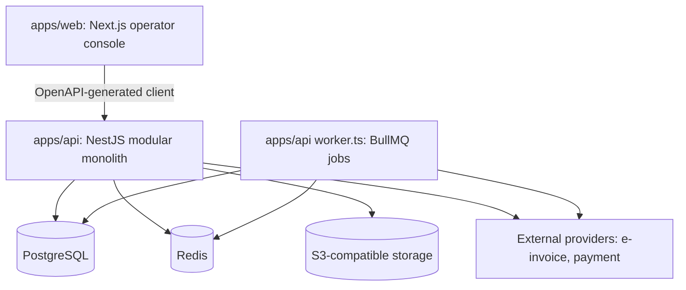

# System Architecture

| Field      | Value                                                    |
| ---------- | -------------------------------------------------------- |
| Status     | Active                                                   |
| Date       | 2026-07-06                                               |
| Scope      | Stack decisions, monorepo layout, platform layers        |
| Depends on | `docs/business/academic-business-architecture.md`        |

## 1. Decision

Build one **modular monolith**: `NestJS + Drizzle + PostgreSQL`, TypeScript
end to end, in a pnpm + Turborepo monorepo.

This is the settled backend direction. Do not reopen it per feature.

## 2. Why This Stack

**NestJS over Spring Boot** — the project is optimized for fast fullstack delivery
by a small team:

- one language across web, api, worker, and shared packages
- OpenAPI-generated frontend client/types straight from NestJS DTOs
- lighter compute footprint during MVP
- faster iteration while business scope is still being validated

Revisit only if a JVM-only integration becomes mandatory (e.g. a provider SDK with
no usable Node client) or the team strategy shifts to Java hiring. Neither blocks
phase 1.

**Drizzle over Prisma** — the system needs persistence discipline:

- SQL-first modeling, explicit queries
- no pressure to treat ORM models as domain entities
- clean mapping from rows to domain objects in heavy modules
- explicit transactions, which the finance domain benefits from

The trade-off is deliberate transaction handling in service/application code.
See `03-backend-conventions.md` section on transactions.

## 3. High-Level Shape



Jobs run **in-process in `apps/api`** by default; `worker.ts` is a second
entrypoint of the same app (same modules, same tenant-context rules,
`04-tenancy-and-data-scope.md`) that can be run as a separate process later
without code changes.

## 4. Monorepo Layout

```txt
apps/
  api/        NestJS backend — HTTP (main.ts) + worker entrypoint (worker.ts)
  web/        Next.js operator console

packages/
  database/   Drizzle schema, client, migrations, seed  (DB source of truth)
  shared/     framework-free logic shared by api and web (e.g. Money)
```

Rules:

1. Apps depend on packages via `workspace:*`; TS path aliases live in
   `tsconfig.base.json`.
2. `packages/shared` must stay dependency-light and framework-free. Nothing in it
   may import NestJS, Next.js, or Drizzle.
3. `packages/database` is the only place schema is defined. Apps never define
   tables.
4. There is deliberately **no shared API-contracts package**. The web app consumes
   generated types from the API's OpenAPI schema (`07-frontend.md`).

Key commands (root):

```bash
pnpm dev / build / lint / typecheck / test   # turbo across workspaces
pnpm --filter @edtech/api <task>             # single workspace
pnpm db:generate / db:migrate / db:studio / db:seed
docker compose up -d                         # Postgres 16 + Redis 7
```

## 5. Platform Layers

Three levels, strictly ordered:

```txt
shared packages   ->   system module   ->   business modules
(technical)            (SaaS platform)      (product domains)
```

### 5.1 Shared packages

Technical capabilities only: response/error model, tenant context, db client,
queue helpers, money. No product workflows.

### 5.2 `system`

The reusable SaaS platform base: tenant, branch, user, role, permission, data
scope, person, config, dictionary, audit, file metadata.

It must stay reusable for future SaaS products. It must never own education
concepts (enrollment, class, payment, invoice, settlement).

### 5.3 Business modules

Phase 1: `admissions`, `academic`, `scheduling`, `finance`, `reporting`.
Future: `study-abroad`, `labor-export` — added as sibling product modules, never
folded into `academic`.

## 6. Product Module Strategy

The SaaS must support modular selling later:

```txt
Tenant A: Center Management only
Tenant B: Study Abroad only
Tenant C: Center + Study Abroad
Tenant D: Center + Study Abroad + Labor Export
```

Consequences:

- product modules must be separable
- shared platform capability lives in `system`
- shared money capability lives in `finance`

## 7. Runtime Configuration

- API env is validated with zod in `apps/api/src/config/server-env.ts` and read
  only through `ConfigService<ServerEnv, true>`. Feature modules never read
  `process.env`.
- Env files load from repo root or app folder: `../../.env.local`, `../../.env`,
  `.env.local`, `.env`.
- Two database URLs (see `04-tenancy-and-data-scope.md`):
  - `DATABASE_URL` — runtime role (no RLS bypass), used by api and worker
  - `DATABASE_MIGRATE_URL` — owner role, used by drizzle-kit and seed
- `.env.example` must stay in sync with required variables.

## 8. Non-Goals for Phase 1

Do not build:

- microservices, full CQRS, event-driven-everything
- plugin marketplace, generic workflow engine
- full accounting ledger, tax engine
- parent/mobile portal, LMS features
- study-abroad or labor-export workflows

The system should stay serious, but not theatrical.
