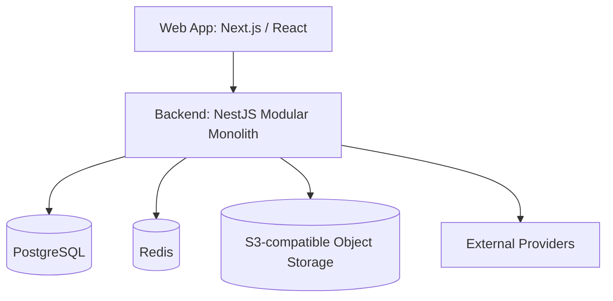

# System Architecture v2

| Field      | Value                                                                                                      |
| ---------- | ---------------------------------------------------------------------------------------------------------- |
| Status     | Draft for review                                                                                           |
| Date       | 2026-07-05                                                                                                 |
| Scope      | Core architecture for the NestJS and Drizzle modular monolith                                              |
| Depends on | `README.md`, `docs/business/academic-business-architecture.md`, `docs/business/competitor-landscape-vn.md` |

## 1. Decision

Use `NestJS + Drizzle + PostgreSQL` as the backend foundation.

This is the final backend direction for now.

The product should be built as a modular monolith, not microservices.

## 2. Why NestJS and Drizzle

NestJS is the better fit for the current product strategy because the project is optimized for fast fullstack delivery and AI-assisted development:

- same language across frontend and backend
- easier fullstack refactoring
- shared TypeScript contracts where useful
- faster iteration while business scope is still being validated
- lighter compute profile during MVP stage

Drizzle is preferred over Prisma because this system still needs stronger persistence discipline:

- SQL-first modeling
- clear table/schema ownership
- less pressure to treat ORM models as domain entities
- easier mapping between persistence rows and domain objects in heavy modules
- good fit for finance, scheduling, and academic lifecycle rules

The trade-off is that transaction boundaries must be handled deliberately in application/service code.

## 3. High-Level Shape



## 4. Platform Layers

The product should be organized into three large levels:

```txt
shared packages
system
business modules
```

## 4.1 `shared packages`

Reusable technical foundation.

Examples:

- common response/error model
- auth/session helpers
- database config
- tenant context
- data permission support
- audit support
- file storage adapter
- queue/job support
- shared contracts
- shared UI primitives

This layer should contain technical capabilities, not product business workflows.

## 4.2 `system`

Reusable SaaS admin/platform module.

Examples:

- tenant
- branch
- user
- role
- permission
- data scope
- menu
- config
- dictionary
- audit log
- login log
- file metadata
- notification template
- scheduled job metadata

This layer should be reusable across future SaaS products.

It must not own education business concepts like enrollment, class, payment, invoice, or teacher settlement.

## 4.3 `business modules`

Product-specific domains.

Phase-1 modules:

- `admissions`
- `academic`
- `scheduling`
- `finance`
- `reporting`

Future product modules:

- `study-abroad`
- `labor-export`

## 5. Product Module Strategy

The SaaS should support modular selling later:

```txt
Tenant A: Center Management only
Tenant B: Study Abroad only
Tenant C: Center + Study Abroad
Tenant D: Center + Study Abroad + Labor Export
```

This means:

- product modules must be separable
- shared platform capabilities live in `system`
- shared money capabilities live in `finance`
- future domains must not be hidden inside `academic`

## 6. Backend Stack

Recommended backend stack:

| Area                      | Decision                                                      |
| ------------------------- | ------------------------------------------------------------- |
| Runtime                   | Node.js LTS                                                   |
| Framework                 | NestJS                                                        |
| Database                  | PostgreSQL                                                    |
| Persistence               | Drizzle ORM                                                   |
| Migration                 | Drizzle migrations                                            |
| API contract              | REST + OpenAPI, plus shared TypeScript contracts where useful |
| Auth                      | app-owned RBAC/data scope                                     |
| Cache / lightweight queue | Redis                                                         |
| Jobs                      | BullMQ when background jobs become necessary                  |
| File storage              | S3-compatible storage                                         |

## 7. Frontend Stack

Recommended frontend stack:

| Area         | Decision                                          |
| ------------ | ------------------------------------------------- |
| Framework    | Next.js / React                                   |
| Language     | TypeScript                                        |
| API contract | generated from OpenAPI or shared contract package |
| UI purpose   | operator SaaS, not marketing-first UI             |

Frontend and backend may share request/response contracts, validation schemas, and enums.

They should not share backend domain objects as UI models.

## 8. Event Strategy

Use events lightly.

Events should be:

- internal
- post-commit
- used for downstream reactions

Good event use cases:

- reporting projection refresh
- notification
- invoice provider sync
- payment reconciliation job
- export generation

Do not use events to replace core transactional workflows.

## 9. Non-Goals in Phase 1

Do not build these in phase 1:

- microservices
- full CQRS framework
- event-driven everything
- plugin marketplace
- generalized workflow engine
- full accounting ledger
- full study-abroad/labor-export workflow

The system should stay serious, but not theatrical.
