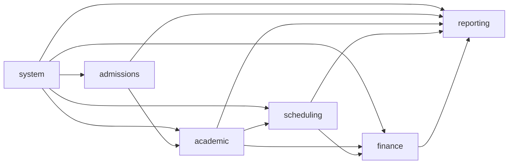

# Module Boundaries

| Field      | Value                                                                 |
| ---------- | --------------------------------------------------------------------- |
| Status     | Active                                                                |
| Date       | 2026-07-06                                                            |
| Scope      | Backend module map, ownership, and boundary rules                     |
| Depends on | `01-system-architecture.md`, `docs/business/academic-context-map.md`  |

## 1. Module Map

Future product modules (`study-abroad`, `labor-export`, `lms`) sit beside the
business modules. They depend on `system` (identity, entitlement) and reach money
only through `finance`'s charge basis; `lms` additionally consumes class,
enrollment, session, and attendance facts through `academic`/`scheduling` service
APIs. AI-assisted features are a consumer layer on top of read models, events,
and audit — they propose module commands and never write business truth directly.

## 2. Classification

| Module       | Weight | Shape                                              | Why                                            |
| ------------ | ------ | -------------------------------------------------- | ---------------------------------------------- |
| `system`     | Light  | `controller -> service -> repository`              | platform CRUD + access control                 |
| `admissions` | Light  | `controller -> service -> repository`              | pipeline CRUD in v1                            |
| `academic`   | Heavy  | `interfaces -> application -> domain -> infrastructure` | enrollment lifecycle, transfer, hold      |
| `scheduling` | Heavy  | same                                               | conflict detection, calendars, feasibility     |
| `finance`    | Heavy  | same                                               | money calculation, allocation, settlement      |
| `reporting`  | Light  | `controller -> service -> repository`              | read models only                               |

A light module may be promoted to heavy when it gains real lifecycle, rule, or
calculation complexity. Start simple.

## 3. Ownership

### `system`

Owns: tenant, branch, user, role, permission, data scope, person, person
dedup/merge (audited re-pointing of references), contact info, guardian
relationship, module entitlement (which product modules a tenant has enabled),
menu, config, dictionary, audit log, file metadata.

Does not own: any education business concept.

### `admissions`

Owns: lead, prospect, source channel, consultation, placement assessment,
promotion offer intent, conversion intent into enrollment.

Does not own: active enrollment, receivables, payment, invoice.
Admissions stops where active study participation begins.

### `academic`

Owns: program, program offering, class (incl. level semantics), enrollment,
enrollment status, transfer, hold/pause, re-entry, teacher assignment, learner
attendance (presence in delivered sessions).

Does not own: payment, invoice, teacher commercial terms, room/time truth.
If the question is "what is this learner actually studying right now?", the
answer lives here.

### `scheduling`

Owns: room, room capacity, time slot, recurring schedule, session calendar,
session occurrence facts (session ran/cancelled, actual teacher), teacher
availability, room allocation, conflict detection, reschedule, make-up session,
substitute teacher.

Does not own: class identity, enrollment state, pricing, receivables.

### `finance`

Owns: pricing rule, financial terms, charge basis (the module-agnostic
origin reference on money records), receivable, payment request, payment
transaction, payment allocation, invoice lifecycle, invoice issuer/tax profile,
teacher commercial terms, teacher settlement, expense, payable.

Does not own: program catalog, schedule truth, lead workflow.
Finance owns all money records even when another module triggers them.

### `reporting`

Owns: dashboards, KPI definitions, read models, exports.

Does not own: any source transaction truth or write workflow.

### `tasks` (reserved, built with admissions)

Light platform module for human work items: assignee, due date, status, and a
module-agnostic link `(source_module, entity_type, entity_id)` to the record
the task is about. Consumers create tasks about their records; the module owns
no business lifecycle and is not a workflow engine. Due tasks emit events for
notification; AI-proposed actions surface here as suggested tasks.

## 4. Boundary Rules

1. One module must not write another module's tables directly.
2. Cross-module reads use service methods, query APIs, or reporting views —
   never another module's repository.
3. Business modules may reference stable IDs from `system`.
4. Drizzle rows never cross a module boundary (`03-backend-conventions.md`).
5. Reporting is downstream only. It must never become a hidden write surface or
   a replacement source of truth.

## 5. Separations That Must Never Collapse

These come from `docs/business/academic-business-rules.md` and are the most
common failure mode for this kind of product:

1. `Person` is not `Student`, `Teacher`, or `User Account` — roles, not silos.
2. `Role` is not `Data Scope`.
3. `Lead/Prospect` is not `Enrollment`.
4. `Program` is not `Class`.
5. `Enrollment` is not `FinancialTerms`.
6. `TeacherAssignment` is not `TeacherCommercialTerms`.
7. `Receivable` is not `Payment` is not `Invoice`.
8. `Expense` is not `Payable`.
9. `Transfer`, `Hold`, `Re-entry` are business events, not silent field edits.
10. Skip-level participation must not automatically charge skipped steps.
11. Finance money records reference a charge basis, never a product module's
    tables directly.
12. `PaymentTransaction` belongs to the paying party (often a guardian);
    allocation links it to learners' receivables.
13. `Attendance` is not `Enrollment` — presence fact vs participation right.
