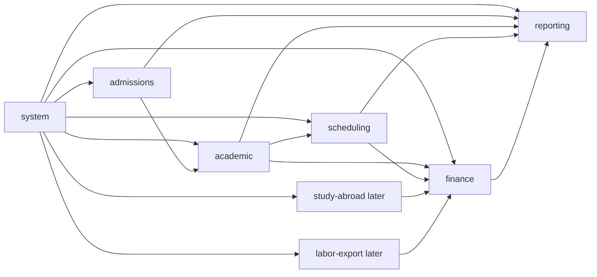

# Module Boundaries v2

| Field      | Value                                                                |
| ---------- | -------------------------------------------------------------------- |
| Status     | Draft for review                                                     |
| Date       | 2026-07-05                                                           |
| Scope      | NestJS module boundaries for the first product version               |
| Depends on | `01-system-architecture.md`, `docs/business/academic-context-map.md` |

## 1. Purpose

This document defines the module boundaries that implementation should follow.

It is intentionally smaller than the previous module docs.

## 2. Module Map

## 3. `system`

Reusable platform module.

Owns:

- tenant
- branch
- user
- role
- permission
- data scope
- person
- menu
- config
- dictionary
- audit
- file metadata

Does not own:

- lead workflow
- enrollment
- class lifecycle
- room schedule
- payment business flow
- invoice business lifecycle
- teacher settlement

## 4. `admissions`

Light module in phase 1.

Owns:

- lead
- prospect
- consultation
- placement assessment
- promotion offer intent
- source channel

Main role:

- bring a person into the center pipeline
- prepare conversion into academic enrollment

Does not own:

- active enrollment
- receivables
- payment
- invoice

## 5. `academic`

Heavy module.

Owns:

- program
- program offering
- class
- class semantics
- enrollment
- transfer
- hold/pause
- re-entry
- teacher assignment

Main role:

- source of truth for what learners are actually studying

Does not own:

- payment
- invoice
- teacher commercial terms
- room/time truth

## 6. `scheduling`

Heavy module.

Owns:

- room
- room capacity
- recurring schedule
- session calendar
- teacher availability
- conflict detection
- reschedule
- make-up session

Main role:

- source of truth for whether academic delivery can run in real time and space

Does not own:

- class identity
- enrollment state
- pricing
- receivables

## 7. `finance`

Heavy shared money module.

Owns:

- pricing rule
- enrollment financial terms
- receivable
- payment request
- payment transaction
- payment allocation
- invoice
- teacher commercial terms
- teacher settlement
- expense
- payable

Main role:

- source of truth for money, debt, invoice, expense, and settlement

Important:

- finance is shared by future product modules
- study abroad and labor export should create billable/payable basis, then finance handles money records

## 8. `reporting`

Light read-model module.

Owns:

- operational dashboards
- finance summaries
- branch control views
- read models
- exports

Does not own:

- source transaction truth
- business write workflows

## 9. Future Modules

## 9.1 `study-abroad`

Future product module.

Should own:

- study-abroad case
- counseling pipeline
- school application
- visa/document workflow
- offer/deposit workflow

Should use:

- `system` for person/user/branch/scope
- `finance` for receivables, payment, invoice, expense, payable

## 9.2 `labor-export`

Future product module.

Should own:

- worker candidate case
- training workflow
- contract workflow
- deployment process
- compliance documents

Should use:

- `system`
- `finance`

## 10. Boundary Rules

1. One module must not write another module's tables directly.
2. Cross-module reads should use service methods, query APIs, or reporting views.
3. Business modules may reference stable IDs from `system`.
4. Finance owns money records even when money is triggered by another module.
5. Reporting is downstream only.

## 11. Implementation Rule

Each module should start simple.

Only add deeper domain modeling when the module has real lifecycle, rule, or calculation complexity.
