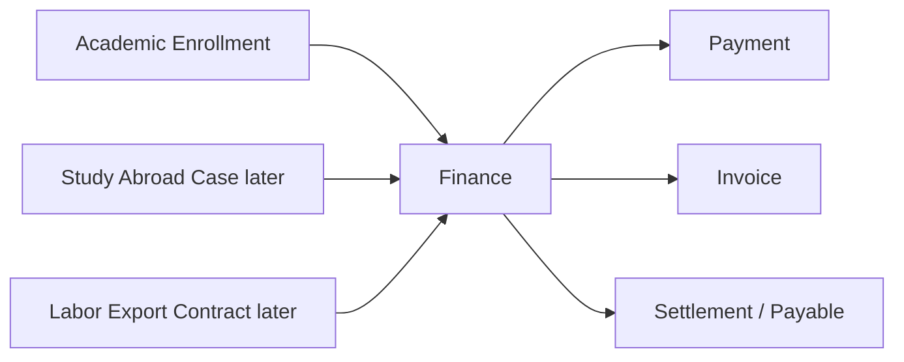

# Data, Finance, and Integration v2

| Field      | Value                                                                               |
| ---------- | ----------------------------------------------------------------------------------- |
| Status     | Draft for review                                                                    |
| Date       | 2026-07-05                                                                          |
| Scope      | Core persistence, finance, tenant, and integration rules                            |
| Depends on | `01-system-architecture.md`, `02-module-boundaries.md`, `03-backend-conventions.md` |

## 1. Purpose

This document captures the technical rules that matter most for correctness.

It intentionally avoids full schema design.

## 2. Database Direction

Use `PostgreSQL`.

Use `Drizzle` for schema and migrations.

Use Drizzle as the default persistence/query layer, with explicit SQL when needed for:

- complex reporting
- finance calculations that need explicit SQL
- reconciliation queries
- performance-sensitive reads

Drizzle table definitions are persistence schema.

They are not domain entities.

## 3. Tenant and Branch Model

Every business table should carry:

- `tenant_id`

Most operational tables should also carry:

- `branch_id`

Examples:

- class
- room
- enrollment
- payment transaction
- expense
- receivable

Some shared tables may be tenant-scoped but not branch-scoped:

- user
- role
- permission
- tenant config

## 4. Data Permission Direction

Use application-level data permission first.

The system should support:

- tenant-wide scope
- branch-set scope
- single-branch scope
- self scope

This keeps the MVP simpler while still preserving tenant and branch scope in services, application use cases, and repositories.

PostgreSQL RLS can be considered later if the system needs stronger database-level isolation.

## 5. Finance Is Shared

Finance is not only academic finance.

It is a shared money module for current and future product modules.



## 6. Finance Core Records

Finance should keep these records separate:

- pricing rule
- financial terms
- receivable
- payment request
- payment transaction
- payment allocation
- invoice
- teacher commercial terms
- teacher settlement
- expense
- payable

Do not collapse these into one generic transaction table too early.

## 7. Academic to Finance Rule

Academic owns study participation.

Finance owns money.

The flow is:

```txt
Enrollment -> EnrollmentFinancialTerms -> Receivable -> Payment -> Invoice
```

Important:

- enrollment does not mean payment
- payment does not mean invoice
- invoice does not mean payment
- skipped academic participation should not be charged by default

## 8. Teacher Settlement Rule

Teacher assignment and teacher commercial terms are separate.

The flow is:

```txt
TeacherAssignment + TeacherCommercialTerms + Payment/Schedule Facts
  -> TeacherSettlement
  -> Payable
```

This supports both:

- center-led fixed salary or per-session payment
- teacher-led revenue share

## 9. Payment and Invoice Integrations

Phase 1 should support:

- cash recording
- bank transfer recording
- VietQR-style payment instruction
- invoice records

Provider automation can come later.

Integration rules:

1. Create internal records before external calls.
2. Do not call slow providers inside a transaction.
3. Store provider reference IDs.
4. Make callbacks idempotent.
5. Keep provider payloads out of domain objects.

## 10. Reporting Data

Reporting should be downstream.

It can use:

- query views
- denormalized tables later
- async refresh jobs later

It must not become the place where source business truth is created.

## 11. Data Model Non-Negotiables

Keep these boundaries:

1. `Person` is not `Student`.
2. `Lead` is not `Enrollment`.
3. `Enrollment` is not `FinancialTerms`.
4. `Receivable` is not `Payment`.
5. `Payment` is not `Invoice`.
6. `TeacherAssignment` is not `TeacherCommercialTerms`.
7. `Expense` is not `Payable`.

These separations are more important than choosing a perfect ORM style.
